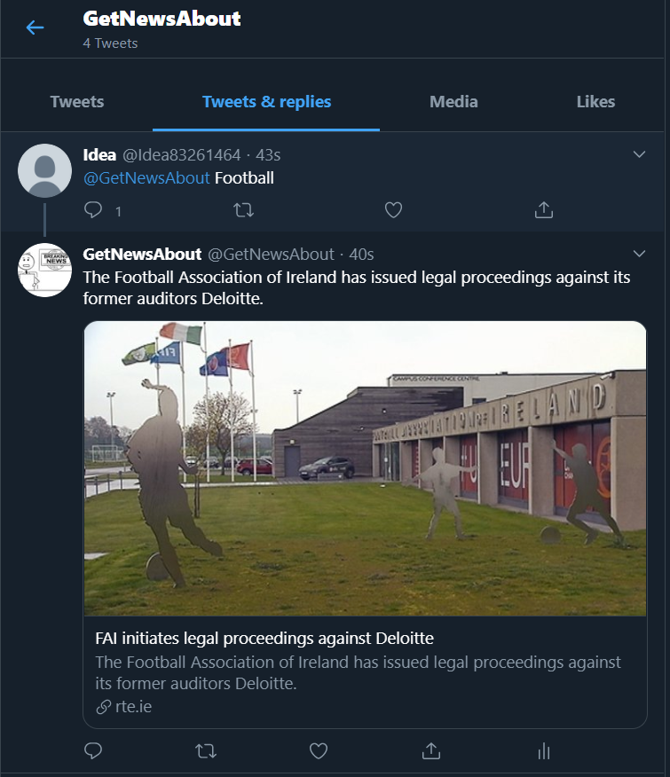

# TwitterNewsBot
Building a twitter bot for displaying news snippets on mention. To use it just [@GetNewsAbout](https://twitter.com/GetNewsAbout) with a topic and we'll reply back with a news article :smiley:



## **Setup**

### **Requirements**

- ```Python>=3.8.1```
- ```Heroku Account``` *(For hosting)* 

To avail all the necessary dependencies for the project
```bash
pip3 install -r requirements.txt
```

### **Get API keys**
#### Twitter API
Register for a [Twitter developer account](https://developer.twitter.com/en). Follow the steps to set up your Bot account and get your API keys.

#### NEWS API
Register at [News API](https://newsapi.org/) and follow the steps to obtain necessary API keys.

### **Set API Keys**
Navigate to the settings tab in your app on Heroku, and then enter all your API keys in the ```Config Vars``` option.

To test your bot locally, add all the API Keys to a file locally and then add it to .gitignore so as to not make it public.

### **Minor Adjustments** *(Fix)*
Turns out Heroku doesn't like to just run scripts with workers, because it expects to see a web server. Follow this [link](https://dev.to/emcain/how-to-set-up-a-twitter-bot-with-python-and-heroku-1n39) to work around it. 
You can fix this by creating a simple web server. ```server.py```